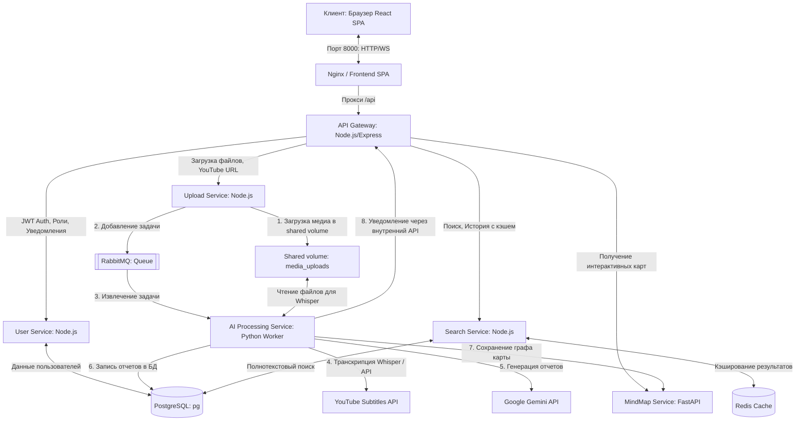

# Полный анализ архитектуры проекта и технологий генерации отчетов

Этот документ представляет собой всесторонний технический анализ платформы **AI Transcription & Analysis Platform** — современной микросервисной системы для транскрибирования аудио- и видеоконтента и формирования глубоких аналитических отчетов с помощью искусственного интеллекта.

---

## 🏗️ 1. Архитектура и состав проекта

Платформа спроектирована по современным лекалам **микросервисной архитектуры** с четким разделением ответственности. Все сервисы упакованы в Docker-контейнеры и работают в изолированной виртуальной сети `ai_network`.

### Схема взаимодействия компонентов



### Состав микросервисов:

1. **Nginx & Frontend Container (`frontend`)**:
   - **Назначение**: Единая точка входа для клиентского трафика. Раздает собранное SPA-приложение на React и выполняет обратное проксирование запросов к API Gateway через путь `/api`.
   - **Порт**: `8000`.

2. **API Gateway (`api-gateway`)**:
   - **Назначение**: Проксирование запросов к внутренним микросервисам (`user-service`, `upload-service`, `search-service`, `mindmap-service`), проверка авторизации пользователей через JWT, валидация токенов и обслуживание WebSocket-соединений для доставки push-уведомлений в реальном времени.
   - **Технологии**: Node.js, Express, `express-http-proxy`, `ws` (WebSockets), `jsonwebtoken`, `helmet` (безопасность заголовков), `morgan` (логирование).

3. **Сервис пользователей (`user-service`)**:
   - **Назначение**: Регистрация, аутентификация, профили пользователей, управление многоуровневой системой ролей (`Standard`, `admin`), валидация электронной почты, модерация (блокировка пользователей), обработка системы отзывов (`feedbacks` и ответы администраторов) и управление внутренними уведомлениями (`notifications`).
   - **Технологии**: Node.js, Express, `pg` (клиент PostgreSQL), `bcryptjs` (хэширование паролей), `nodemailer` (отправка писем верификации).

4. **Сервис загрузки (`upload-service`)**:
   - **Назначение**: Прием входящих аудио- и видеофайлов от пользователей, обработка YouTube-ссылок, сохранение локальных файлов в общую сетевую папку (Docker Volume) и публикация асинхронных задач в очередь RabbitMQ.
   - **Технологии**: Node.js, Express, `multer` (обработка multipart-форм для файлов), `amqplib` (клиент RabbitMQ), `pg`.

5. **Сервис искусственного интеллекта (`ai-processing-service`)**:
   - **Назначение**: Асинхронный Python-воркер, который забирает задачи из RabbitMQ, скачивает аудио с YouTube (в минимальном битрейте для экономии трафика), выполняет распознавание речи в текст (Whisper) или выгружает субтитры напрямую (гибридный подход), отправляет текст в LLM (Gemini) для генерации глубоких структурированных отчетов, записывает результат в базу данных PostgreSQL, отправляет карту знаний в `mindmap-service` и инициирует отправку уведомлений пользователям о готовности отчета.
   - **Технологии**: Python, `pika` (RabbitMQ), `psycopg2` (PostgreSQL), `openai-whisper` (локальное распознавание), `PyTorch` (вычисления с поддержкой GPU CUDA), `yt-dlp` (загрузка аудио), `google-generativeai` (Gemini API), `youtube-transcript-api` (извлечение субтитров), `json-repair` (восстановление JSON).

6. **Сервис поиска (`search-service`)**:
   - **Назначение**: Обеспечение быстрого полнотекстового поиска по всем сохраненным расшифровкам и отчетам пользователя с умным кэшированием результатов в оперативной памяти.
   - **Технологии**: Node.js, Express, `redis` (клиент кэша), `pg`.

7. **Сервис интеллект-карт (`mindmap-service`)**:
   - **Назначение**: Специализированное персистентное файловое хранилище для визуализации графов связей (интеллект-карт). Хранит структуру узлов и ребер, предоставляет API для сохранения, поиска и извлечения карт.
   - **Технологии**: Python, FastAPI, Uvicorn, Pydantic, JSONB-подобное файловое хранилище с атомарной сериализацией.

---

## 📊 2. Технологии и пайплайн генерации Отчетов

Процесс обработки медиафайла и сборки интерактивного отчета состоит из **пяти последовательных этапов**:

```
[Медиафайл / YouTube URL]
         │
         ▼
 ┌──────────────┐      Да      ┌─────────────────────────────────┐
 │ YouTube URL? ├─────────────►│ youtube-transcript-api:         │
 └──────┬───────┘              │ Скачивание готовых субтитров    │
        │ Нет                  └────────────────┬────────────────┘
        ▼                                       │
 ┌──────────────────────────────┐               │ Успешно
 │ yt-dlp:                      │               │
 │ Загрузка аудио 48kbps MP3    │               │
 └──────┬───────────────────────┘               │
        ▼                                       │
 ┌──────────────────────────────┐               │
 │ OpenAI Whisper:              │               │
 │ Распознавание речи на GPU    │               │
 └──────┬───────────────────────┘               │
        ▼                                       │
 ┌──────────────────────────────────────────────┴◄────────────────┐
 │ Полный сырой текст расшифровки                                │
 └──────┬─────────────────────────────────────────────────────────┘
        ▼
 ┌────────────────────────────────────────────────────────────────┐
 │ Google Gemini (3.1 Flash Lite / 2.5 Flash):                   │
 │ Генерация детальной структуры отчета на РУ, EN, KK языках      │
 └──────┬─────────────────────────────────────────────────────────┘
        ▼
 ┌────────────────────────────────────────────────────────────────┐
 │ json-repair: Валидация и восстановление структуры JSON-ответа  │
 └──────┬─────────────────────────────────────────────────────────┘
        ▼
 ┌────────────────────────────────────────────────────────────────┐
 │ Рендеринг и Визуализация в React SPA (Markdown, D3 Force Graph)│
 └────────────────────────────────────────────────────────────────┘
```

### Подробное описание этапов и применяемых технологий:

### 🎙️ Этап A: Извлечение аудио и парсинг субтитров (Hybrid Strategy)
Для минимизации нагрузки на центральный и графический процессоры (CPU/GPU) при обработке YouTube-роликов применяется **гибридный алгоритм**:
1. **Прямое извлечение субтитров (`youtube-transcript-api`)**:
   Воркер настраивает системные прокси-серверы и делает попытку скачать готовые текстовые субтитры видео напрямую с серверов YouTube. Поддерживается мультиязычный приоритет: запрашиваемый пользователем язык ➔ русский ➔ английский. Если субтитры успешно получены, тяжелый этап нейросетевой обработки полностью пропускается.
2. **Оптимизированная загрузка аудио (`yt-dlp` + `ffmpeg`)**:
   Если видео не имеет субтитров, воркер с помощью библиотеки `yt-dlp` скачивает только аудиопоток в минимально возможном качестве (48 kbps, формат MP3). Это экономит дисковое пространство, сетевой трафик и ускоряет загрузку в 10–15 раз по сравнению с загрузкой видео целиком.

### 🧠 Этап B: Локальное распознавание речи (Speech-to-Text via Whisper)
Для файлов, загруженных пользователем с ПК, а также для YouTube-видео без субтитров, запускается локальный конвейер распознавания:
* **Библиотека `openai-whisper` (модель `base`)**:
  Обрабатывает загруженный аудиофайл. Модель с высокой точностью определяет речь, расставляет знаки препинания и делит текст на логические сегменты.
* **Аппаратное ускорение (`PyTorch` + `CUDA`)**:
  Если в системе установлена совместимая видеокарта NVIDIA, вычисления автоматически переносятся на GPU. Для оптимизации энергопотребления и видеопамяти применяется режим вычислений с половинной точностью (**FP16 / Float16**), что ускоряет транскрибацию в 2–3 раза без потери качества распознавания.

### 🤖 Этап C: Семантический мультиязычный анализ (LLM Processing)
На этом этапе сырой текст превращается в структурированные знания с помощью Google Generative AI:
* **Модель ИИ**: Используется **Google Gemini 3.1 Flash Lite** (или **Gemini 2.5 Flash**), обладающая широким контекстным окном и высокой скоростью инференса.
* **Мультиязычность "из коробки"**: Вместо последовательных и дорогих запросов на разных языках, Gemini за один проход генерирует структурированный ответ **сразу на трех языках: русском (ru), английском (en) и казахском (kk)**.
* **Динамическое масштабирование детализации**: Воркер высчитывает длину распознанного текста и подставляет соответствующий промпт. В зависимости от объема (до 8 000 символов, от 8 000 до 18 000 и свыше 18 000 символов), жестко масштабируются требования к детализации генерируемых разделов:
  - Количество абзацев обзора увеличивается от 3 до 6.
  - Количество ключевых тем возрастает с 3 до 8.
  - Размер сравнительных таблиц масштабируется от 3х2 до 6х4.
  - Количество карточек запоминания увеличивается с 6 до 12.
* **Иллюстрирование отчетов (Loremflickr API)**: Промпт обязывает модель подбирать точечные англоязычные ключевые слова (`KEYWORD`) под контекст материала и автоматически формировать разметку изображений вида `` для разделов краткого обзора и детального анализа. Это оживляет сухой текст визуальными премиальными обложками.
* **Устойчивость к сбоям (`json-repair`)**: Ответы LLM в формате JSON могут страдать от срезанных окончаний при обрыве соединения или синтаксических неточностей. Библиотека `json-repair` на лету исправляет незакрытые скобки, кавычки и пропущенные запятые, исключая падение фонового воркера и гарантируя парсинг отчета.

### 📝 Этап D: Структура и компоненты итогового Отчета
В результате работы ИИ-конвейера в базу данных сохраняется богатый JSON-объект, содержащий следующие компоненты:

| Компонент отчета | Тип данных | Описание и визуальные фичи |
| :--- | :--- | :--- |
| **Title (Название)** | Локализованный текст | Емкое название анализируемого видео (до 15 слов). |
| **Summary (Обзор)** | Markdown с таблицами и фото | Структурированное содержание (3-6 абзацев) с встроенной Markdown-таблицей параметров/хронологии и тематическим изображением. |
| **Key Topics (Ключевые темы)** | Массив объектов | Список из 3–8 разделов. Каждый включает название, развернутый список тезисов (3–5 штук) и текстовое обоснование важности (`relevance`). |
| **Detailed Analysis (Детальный отчет)** | Массив Markdown-блоков | Академически глубокий отчет (4-8 абзацев) с разбором скрытых мотивов, имен, дат, сопоставительной Markdown-таблицей и иллюстрацией. |
| **Takeaways (Главные выводы)** | Массив тезисов | 5–12 ключевых инсайтов, сформулированных в виде емких интеллектуально богатых утверждений. |
| **Flashcards (Карточки)** | Пара "Вопрос-Ответ" | 6–12 интерактивных карточек для активного обучения и запоминания терминов. |
| **Quiz (Тест)** | Массив вопросов | Интерактивный опросник из 10 вопросов с 4 вариантами ответов и разметкой правильного ответа. |
| **Mind Map (Интеллект-карта)** | Иерархический граф | Набор узлов (`nodes`) трех типов (корень, темы, подтемы) и направленных связей (`links`) между ними. |

### 💻 Этап E: Визуализация и рендеринг в Frontend React UI
Для отображения собранных отчетов на клиенте используются продвинутые библиотеки:
1. **Отрисовка текста (`react-markdown` + `remark-gfm`)**:
   Компоненты обзора и детального анализа рендерятся как полноценные веб-страницы. Плагин `remark-gfm` обеспечивает поддержку форматирования таблиц (с границами, выравниванием), списков задач, цитат и ссылок.
2. **Интерактивный граф интеллект-карты (`react-force-graph-2d` + `d3-force`)**:
   Отображает структуру данных `mind_map` в виде живой физической модели.
   - **Метод вычислений**: Силы притяжения и отталкивания рассчитываются на базе алгоритмов D3.
   - **Фичи**: Пользователь может перетаскивать узлы мышкой (сохраняя кинетическую энергию отскока), зумировать колесиком мыши, кликать на темы для подсветки связей. Граф плавно анимирован и выглядит премиально благодаря кастомной отрисовке холста.
3. **Виджеты обучения (React Components)**:
   - **Флеш-карты**: Стилизованные 3D CSS-карты с эффектом переворота при клике (`transform: rotateY(180deg)`), меняющие цвет стороны вопроса и ответа.
   - **Интерактивные тесты**: Пошаговый интерфейс тестирования с анимацией выбора ответа, подсветкой ошибок красным, правильных вариантов зеленым и итоговым экраном прогресса.

---

## 💾 3. Схема хранения данных отчета (PostgreSQL JSONB)

Для быстрого доступа и гибкости отчетов используется гибридный реляционно-документный подход в PostgreSQL. Метаданные отчетов хранятся в таблице `transcriptions` с типом поля `JSONB`.

```sql
-- Таблица транскрипций и отчетов
CREATE TABLE transcriptions (
    id SERIAL PRIMARY KEY,
    job_id INTEGER NOT NULL,
    user_id INTEGER NOT NULL,
    raw_text TEXT NOT NULL,                -- Полный сырой текст распознавания
    structured_analysis JSONB,             -- Весь структурированный мультиязычный JSON отчета
    created_at TIMESTAMP DEFAULT CURRENT_TIMESTAMP
);

-- Индексация для мгновенного поиска внутри JSONB
CREATE INDEX idx_transcriptions_analysis ON transcriptions USING gin (structured_analysis);
```

### Структура документа в `structured_analysis` (Контракт API):
```json
{
  "language": "ru",
  "title": {
    "ru": "Название на русском",
    "en": "Title in English",
    "kk": "Қазақша атауы"
  },
  "summary": {
    "ru": "### Обзор\n\nТекст обзора с таблицей...\n\n",
    "en": "### Summary\n\nSummary text with table...\n\n",
    "kk": "### Шолу\n\nКестесі бар шолу мәтіні...\n\n"
  },
  "key_topics": [
    {
      "title": {
        "ru": "Тема 1",
        "en": "Topic 1",
        "kk": "Тақырып 1"
      },
      "key_points": {
        "ru": ["Тезис 1.1", "Тезис 1.2"],
        "en": ["Bullet 1.1", "Bullet 1.2"],
        "kk": ["Тұжырым 1.1", "Тұжырым 1.2"]
      },
      "relevance": {
        "ru": "Почему это важно...",
        "en": "Why this is important...",
        "kk": "Бұл неліктен маңызды..."
      }
    }
  ],
  "detailed_analysis": {
    "ru": "### Глубокий анализ\n\nДетальный текст с таблицей сравнения...\n\n",
    "en": "### Detailed Analysis\n\nDetailed text with comparison table...\n\n",
    "kk": "### Толық талдау\n\nСалыстырмалы кестесі бар толық мәтін...\n\n"
  },
  "takeaways": {
    "ru": ["Вывод 1", "Вывод 2"],
    "en": ["Takeaway 1", "Takeaway 2"],
    "kk": ["Тұжырымдама 1", "Тұжырымдама 2"]
  },
  "flashcards": [
    {
      "question": {
        "ru": "Вопрос?",
        "en": "Question?",
        "kk": "Сұрақ?"
      },
      "answer": {
        "ru": "Ответ",
        "en": "Answer",
        "kk": "Жауап"
      }
    }
  ],
  "quiz": [
    {
      "question": {
        "ru": "Вопрос теста?",
        "en": "Quiz Question?",
        "kk": "Тест сұрағы?"
      },
      "options": {
        "ru": ["Вариант А", "Вариант Б", "Вариант В", "Вариант Г"],
        "en": ["Option A", "Option B", "Option C", "Option D"],
        "kk": ["А нұсқасы", "Б нұсқасы", "В нұсқасы", "Г нұсқасы"]
      },
      "correct_answer": {
        "ru": "Вариант А",
        "en": "Option A",
        "kk": "А нұсқасы"
      }
    }
  ],
  "mind_map": {
    "nodes": [
      {
        "id": "root",
        "text": { "ru": "Корень", "en": "Root", "kk": "Түбір" },
        "category": { "ru": "Категория", "en": "Category", "kk": "Санат" },
        "type": "root"
      }
    ],
    "links": [
      {
        "source": "root",
        "target": "topic_1",
        "label": { "ru": "Связь", "en": "Link", "kk": "Байланыс" }
      }
    ]
  }
}
```

