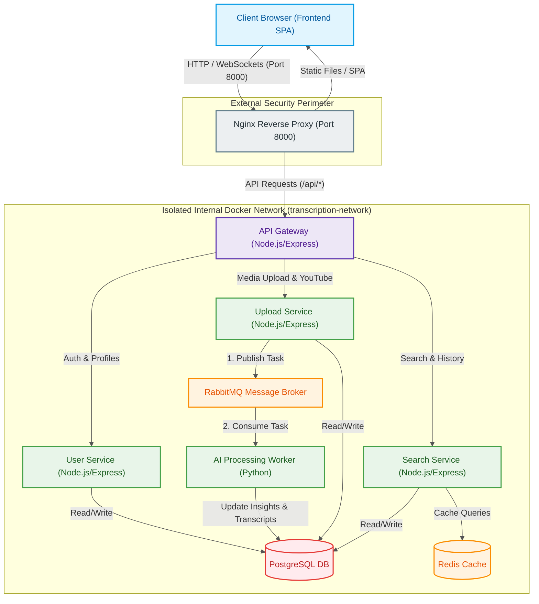

# 4.3 Microservice-Oriented Development

The project is built on a modern distributed microservice architecture deployed in an isolated Docker environment. Using containerization achieves high scalability, reliability, and independent deployment of each individual system component.

## Docker Microservice Infrastructure Diagram

Below is the structural diagram of the containerized platform infrastructure, illustrating service interactions through a secure internal Docker network (`transcription-network`) and a single entry point based on Nginx.

### Description of Infrastructure Components

1. **Nginx Reverse Proxy:** Acts as a single entry point for the entire system. It accepts all external requests on port 8000, separates static frontend content (React SPA) and dynamic API requests, proxying the latter to the API Gateway.
2. **API Gateway:** Acts as the internal orchestrator. It provides unified JWT-based authentication, basic parameter validation, and routes traffic to isolated microservices within the Docker network.
3. **User Service:** Service responsible for user registration, profile management, secure password hashing (bcrypt), and authorization.
4. **Upload Service:** Handles file uploads (audio/video) of various formats, performs primary validation, saves media data to temporary storage, and publishes transcription and analysis tasks to the RabbitMQ message broker.
5. **AI Processing Worker:** Python service acting as a queue processor. It consumes tasks from RabbitMQ, extracts audio tracks if necessary, interacts with the Google Gemini API to get transcriptions, summaries, and interactive materials, and then writes the results directly to PostgreSQL.
6. **Search Service:** Provides high-speed full-text search across transcriptions and analysis history. It is integrated with Redis to cache frequent search queries and unload the primary relational database.
7. **PostgreSQL & Redis & RabbitMQ:** System resources deployed in separate containers, isolated from the outside world and accessible only to microservices inside `transcription-network`.
