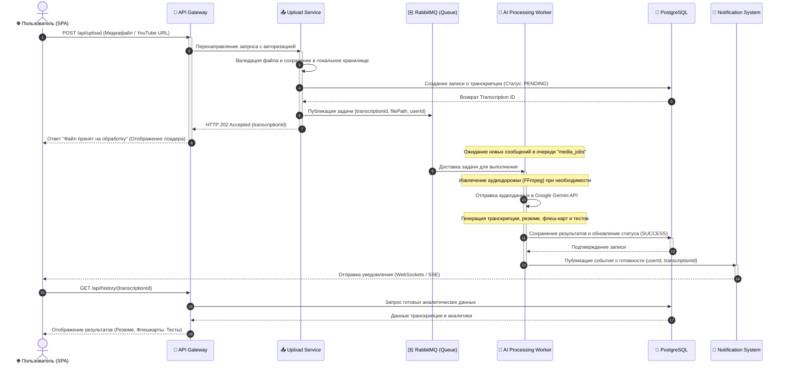

# 4.5 Асинхронная обработка медиафайлов (Asynchronous Media Processing)

Обработка аудио- и видеофайлов большого объема, а также генерация глубокого семантического анализа с использованием моделей искусственного интеллекта являются ресурсоемкими операциями. Для обеспечения высокой отзывчивости пользовательского интерфейса и предотвращения блокировок HTTP-соединений в платформе реализована полностью асинхронная модель обработки данных.

## Асинхронный воркфлоу обработки (Asynchronous Processing Workflow)

Процесс обработки медиафайла проходит через следующие ключевые компоненты системы:
**Upload Service → RabbitMQ → AI Worker → PostgreSQL → Notification System**

Ниже приведена детальная UML-диаграмма последовательности (Sequence Diagram), описывающая жизненный цикл асинхронной задачи:

### Подробное описание этапов обработки

1. **Инициализация запроса:** Пользователь загружает медиафайл или отправляет ссылку на YouTube. Запрос проходит валидацию токена безопасности на `API Gateway`.
2. **Мгновенный ответ (HTTP 202):** `Upload Service` сохраняет медиафайл на сервере, регистрирует транзакцию в `PostgreSQL` с начальным статусом `PENDING`, отправляет задачу в `RabbitMQ` и мгновенно возвращает клиенту HTTP-статус `202 Accepted`. Это освобождает поток запроса пользователя, позволяя ему продолжать работу с интерфейсом.
3. **Очередь сообщений (RabbitMQ):** Выступает в роли буфера сглаживания пиковых нагрузок (Message Broker). Если одновременно поступает много файлов, они выстраиваются в очередь, гарантируя, что система не упадет от нехватки памяти или лимитов API.
4. **Интеллектуальный воркер (AI Worker):** Написан на Python для эффективной работы с библиотеками обработки мультимедиа (FFmpeg). Он извлекает аудио, отправляет его в **Google Gemini 2.5/3.5 Flash** с помощью оптимизированных системных промптов для получения структурированного JSON, содержащего транскрипцию и аналитические материалы.
5. **Сохранение в СУБД:** Воркер записывает структурированные аналитические материалы в специальное поле `JSONB` таблицы транскрипций в `PostgreSQL` и меняет статус на `SUCCESS` (или `FAILED` в случае непредвиденных ошибок).
6. **Push-уведомление:** Система уведомлений (`Notification System`) через WebSockets или Server-Sent Events (SSE) мгновенно информирует клиентское приложение об успешном завершении анализа. SPA-приложение автоматически обновляет интерфейс без необходимости ручной перезагрузки страницы.
