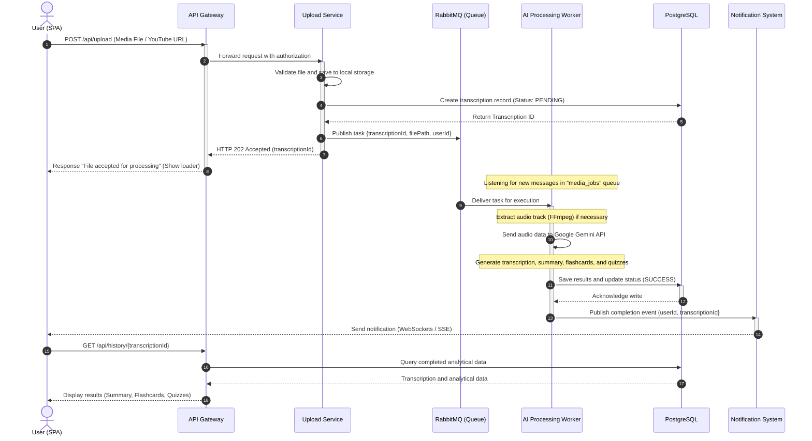

# 4.5 Asynchronous Media Processing

Processing large audio and video files, as well as generating deep semantic analysis using artificial intelligence models, are resource-intensive operations. To ensure high responsiveness of the user interface and prevent HTTP connection timeouts, the platform implements a fully asynchronous data processing model.

## Asynchronous Processing Workflow

The processing of a media file flows through the following key system components:
**Upload Service → RabbitMQ → AI Worker → PostgreSQL → Notification System**

Below is a detailed UML Sequence Diagram describing the lifecycle of an asynchronous task:

### Detailed Processing Stages

1. **Request Initialization:** The user uploads a media file or submits a YouTube URL. The request undergoes JWT validation at the API Gateway.
2. **Instant Response (HTTP 202):** The Upload Service saves the media file on the server, registers a transaction in PostgreSQL with an initial status of `PENDING`, publishes a task to RabbitMQ, and instantly returns an `HTTP 202 Accepted` status to the client. This releases the user request thread, allowing them to continue interacting with the interface.
3. **Message Queue (RabbitMQ):** Serves as a buffer to smooth peak loads (Message Broker). If many files are submitted simultaneously, they queue up, ensuring the system does not crash from memory exhaustion or API rate limits.
4. **Intelligent Worker (AI Worker):** Written in Python for efficient interaction with multimedia processing libraries (FFmpeg). It extracts audio, sends it to Google Gemini 2.5/3.5 Flash using optimized system prompts to obtain structured JSON containing the transcription and analytical data.
5. **Database Persistence:** The worker writes the structured analytical materials directly into a dedicated `JSONB` field of the transcription table in PostgreSQL and updates the status to `SUCCESS` (or `FAILED` in case of unexpected errors).
6. **Push Notification:** The Notification System instantly informs the client application of successful completion via WebSockets or Server-Sent Events (SSE). The SPA automatically updates the user interface without requiring a manual page reload.
