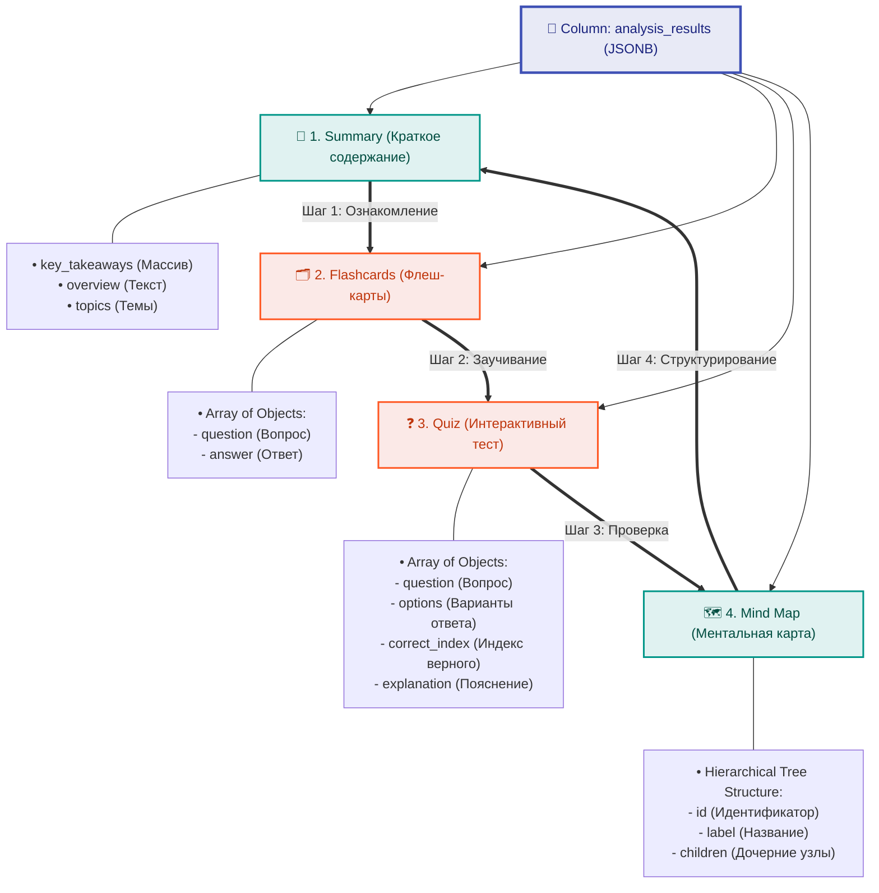

# 4.9 Методология хранения данных (Data Storage Methodology)

Для хранения сложных результатов семантического анализа медиафайлов, генерируемых моделями искусственного интеллекта, в платформе применяется гибридный реляционно-документоориентированный подход. В качестве основного хранилища используется СУБД **PostgreSQL**, поддерживающая высокопроизводительный бинарный формат данных **JSONB**.

Использование `JSONB` позволяет совместить строгую целостность реляционных связей (пользователи, транскрипции) с гибкостью документо-ориентированных баз данных (динамические структуры аналитических материалов, которые могут дополняться без изменения схемы БД).

## Диаграмма аналитической структуры JSONB

Результаты анализа сохраняются в рамках единого структурированного JSONB-документа, который логически разделен на четыре ключевых компонента:



### Преимущества архитектуры JSONB в PostgreSQL

1. **Производительность:** Поиск по элементам JSONB осуществляется с использованием специализированных **GIN-индексов** (Generalized Inverted Index), что обеспечивает скорость выборки на уровне специализированных NoSQL решений (таких как MongoDB).
2. **Гибкость схемы:** AI-модели могут возвращать варьирующееся число вопросов для тестов или сложную многоуровневую структуру ментальных карт. Использование JSONB исключает необходимость создания множества таблиц с каскадными связями (One-to-Many), тем самым повышая скорость чтения данных без дорогостоящих операций `JOIN`.
3. **Целостность транзакций (ACID):** Хранение аналитики непосредственно в PostgreSQL гарантирует полную транзакционную безопасность и синхронность данных с таблицами пользователей и логов загрузок.

---

## Пример структуры документа JSONB в базе данных

Ниже представлен валидный пример JSONB-объекта, сохраняемого в поле `analysis_results` для каждой успешно обработанной транскрипции:

```json
{
  "summary": {
    "overview": "В данном медиаматериале подробно рассматриваются основы создания микросервисной архитектуры с использованием контейнеризации Docker и брокеров сообщений.",
    "key_takeaways": [
      "Микросервисы обеспечивают независимое масштабирование и развертывание компонентов.",
      "RabbitMQ решает проблему пиковых нагрузок с помощью асинхронного буфера сообщений.",
      "PostgreSQL JSONB идеально подходит для хранения слабоструктурированных аналитических данных."
    ],
    "topics": ["Микросервисы", "Docker", "RabbitMQ", "Базы данных"]
  },
  "flashcards": [
    {
      "question": "Что такое Docker?",
      "answer": "Платформа для разработки, доставки и запуска приложений в изолированных контейнерах."
    },
    {
      "question": "В чем главное преимущество JSONB перед обычным JSON в PostgreSQL?",
      "answer": "JSONB хранится в декомпозированном двоичном формате, поддерживает индексацию (GIN) и работает значительно быстрее при парсинге."
    }
  ],
  "quiz": [
    {
      "question": "Какой протокол/компонент является единой точкой входа в инфраструктуру?",
      "options": ["API Gateway", "Nginx Reverse Proxy", "RabbitMQ Queue", "PostgreSQL DB"],
      "correct_index": 1,
      "explanation": "Nginx принимает внешние запросы на порту 8000 и выступает как Reverse Proxy, перенаправляя трафик на API Gateway или отдавая статику."
    }
  ],
  "mind_map": {
    "id": "root",
    "label": "Архитектура Платформы",
    "children": [
      {
        "id": "infra",
        "label": "Инфраструктура",
        "children": [
          {"id": "nginx", "label": "Nginx Reverse Proxy"},
          {"id": "gateway", "label": "API Gateway"}
        ]
      },
      {
        "id": "storage",
        "label": "Хранение данных",
        "children": [
          {"id": "db", "label": "PostgreSQL (JSONB)"},
          {"id": "cache", "label": "Redis"}
        ]
      }
    ]
  }
}
```
