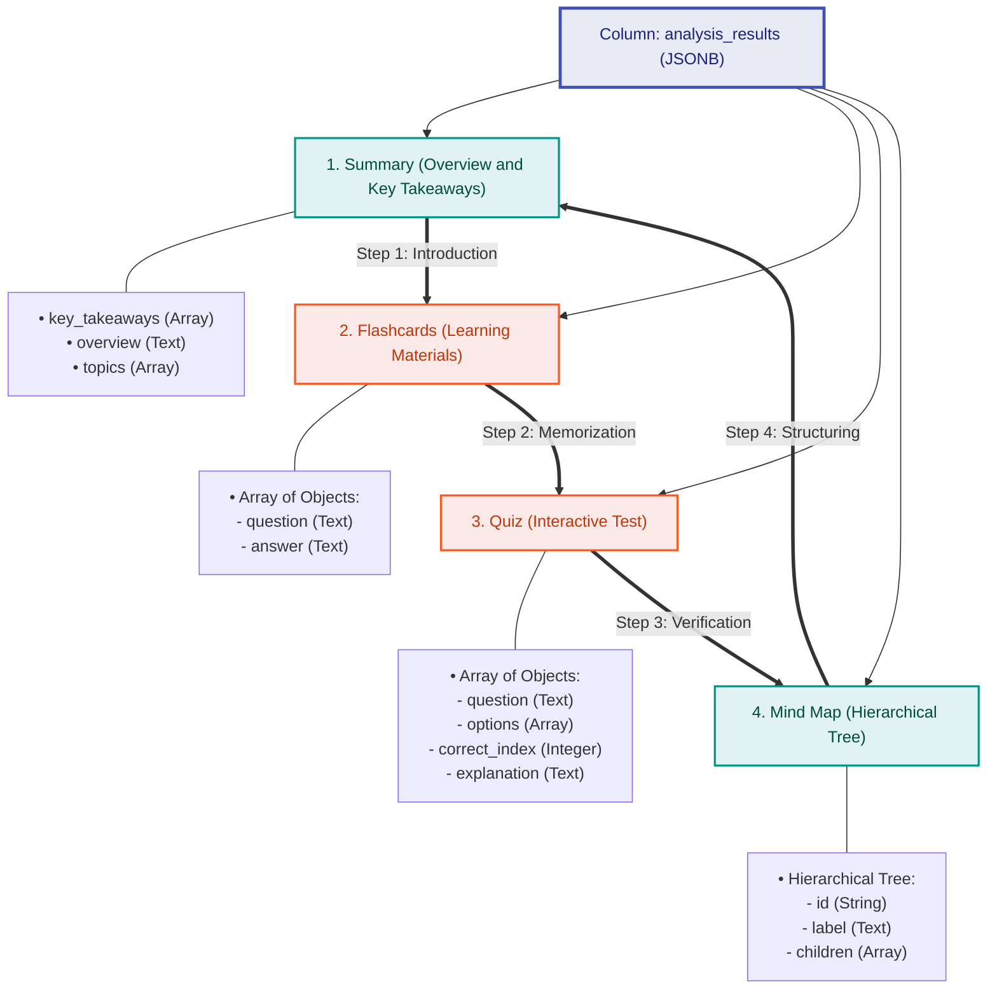

# 4.9 Data Storage Methodology

To store complex results of semantic analysis of media files generated by artificial intelligence models, the platform uses a hybrid relational-document-oriented approach. PostgreSQL, supporting the high-performance binary JSON data format (`JSONB`), is used as the primary storage.

Using JSONB combines the strict integrity of relational connections (users, transcriptions) with the flexibility of document-oriented databases (dynamic structures of analytical materials that can be expanded without database schema migration).

## JSONB Analytical Structure Diagram

The results of the analysis are saved within a single structured JSONB document, which is logically divided into four key components:



### Advantages of JSONB Architecture in PostgreSQL

1. **Performance:** Querying JSONB elements is performed using specialized **GIN indexes** (Generalized Inverted Index), which ensures query speeds on par with dedicated NoSQL solutions (such as MongoDB).
2. **Schema Flexibility:** AI models can return a varying number of quiz questions or a complex nested hierarchical structure for mind maps. Using JSONB eliminates the need to create multiple tables with cascade relationships (One-to-Many), thus increasing the speed of data reading without expensive `JOIN` operations.
3. **Transactional Integrity (ACID):** Storing analysis results directly within PostgreSQL guarantees complete transactional security and synchronization with user and upload metadata tables.

---

## Example of JSONB Document Structure in Database

Below is a valid example of a JSONB object stored in the `analysis_results` field for each successfully processed transcription:

```json
{
  "summary": {
    "overview": "This media material details the fundamentals of building a microservice architecture using Docker containerization and message brokers.",
    "key_takeaways": [
      "Microservices provide independent scaling and deployment of components.",
      "RabbitMQ resolves peak load issues with an asynchronous message buffer.",
      "PostgreSQL JSONB is ideal for storing semi-structured analytical data."
    ],
    "topics": ["Microservices", "Docker", "RabbitMQ", "Databases"]
  },
  "flashcards": [
    {
      "question": "What is Docker?",
      "answer": "A platform for developing, delivering, and running applications in isolated containers."
    },
    {
      "question": "What is the primary advantage of JSONB over standard JSON in PostgreSQL?",
      "answer": "JSONB is stored in a decomposed binary format, supports GIN indexing, and performs significantly faster when parsing."
    }
  ],
  "quiz": [
    {
      "question": "Which protocol/component acts as the single entry point to the infrastructure?",
      "options": ["API Gateway", "Nginx Reverse Proxy", "RabbitMQ Queue", "PostgreSQL DB"],
      "correct_index": 1,
      "explanation": "Nginx accepts external requests on port 8000 and acts as a Reverse Proxy, forwarding traffic to the API Gateway or serving static content."
    }
  ],
  "mind_map": {
    "id": "root",
    "label": "Platform Architecture",
    "children": [
      {
        "id": "infra",
        "label": "Infrastructure",
        "children": [
          {"id": "nginx", "label": "Nginx Reverse Proxy"},
          {"id": "gateway", "label": "API Gateway"}
        ]
      },
      {
        "id": "storage",
        "label": "Data Storage",
        "children": [
          {"id": "db", "label": "PostgreSQL (JSONB)"},
          {"id": "cache", "label": "Redis"}
        ]
      }
    ]
  }
}
```
